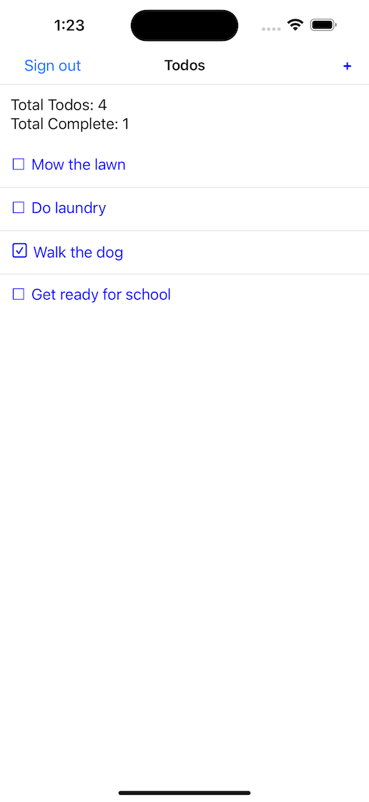

## This project is a Firestore + React Query + React Native template
This project is intended to demonstrate how to use React Query and Firestore together in a simple Todo React Native app. For a complete walkthrough, [read this post](https://medium.com/@seansy/react-native-with-firestore-react-query-typescript-part-1-132284d5ebc0).



## Installation
### Setup Firebase project
- Go to console.firebase.google.com and create a firestore project with analytics disabled
- Add click **iOS+** to add the iOS integration
  - Use `com.todoapp` as the bundle id.
- Add Google Authentication to the project
  - Download the `GoogleService-Info.plist` and place it in the top directory of this project
- Create a Firestore database in firebase first via console.firebase.google.com
- Click "Start collection", name the collection "todos", and create a sample document with fields `title` (string), `isDone` (boolean), and `dateCreated` (Date) fields.
- Open `GoogleService-Info.plist`, and copy the `CLIENT_ID` value and set `EXPO_FIREBASE_CLIENT_ID` to that value in the .env file.

### Install dependencies and create development build

```zsh
npm install
eas build --profile development-simulator --platform ios
```

Once the eas build has completed, download it and drag it into your simulator of choice to run.

## Run the app
Since this is just an expo project, run with
```zsh
npm start
```

Open an iOS simulator, log in with a google account of your choice, and you will see the Todo App demo.

Create Todos by clicking the "+" in the upper right of the nav bar.

## Issues
Having issues with the project? [Submit an issue in Github](https://github.com/wildseansy/react-native-firestore-todo/issues)
